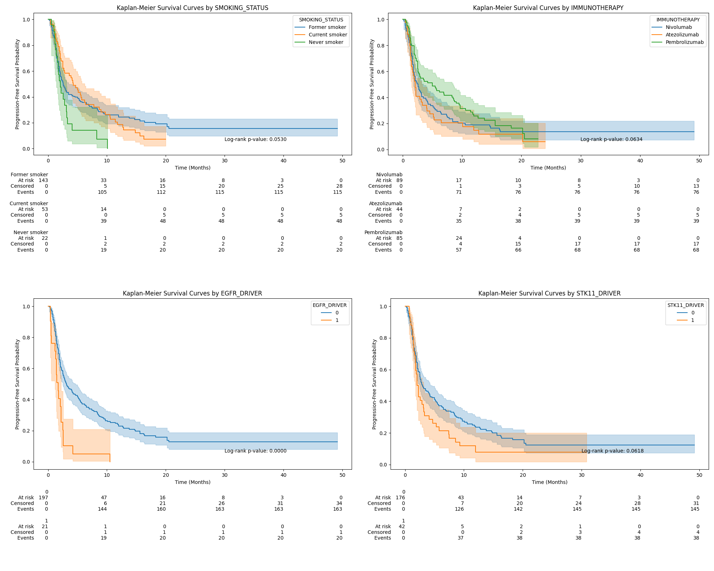
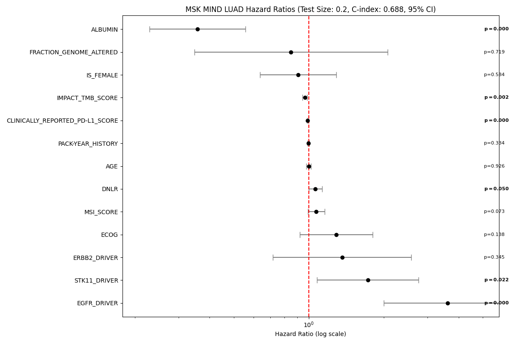
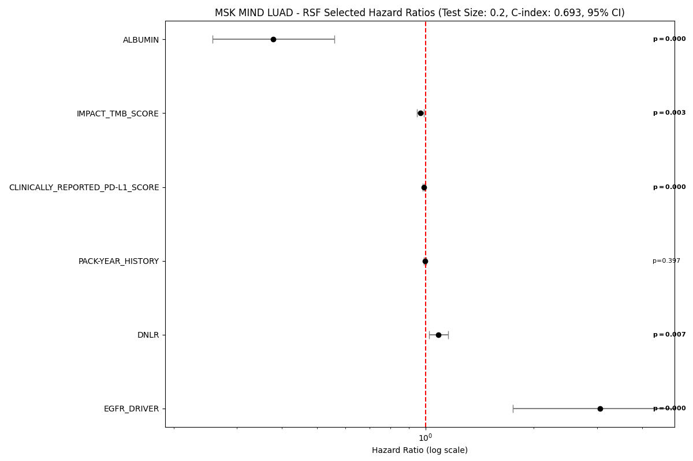
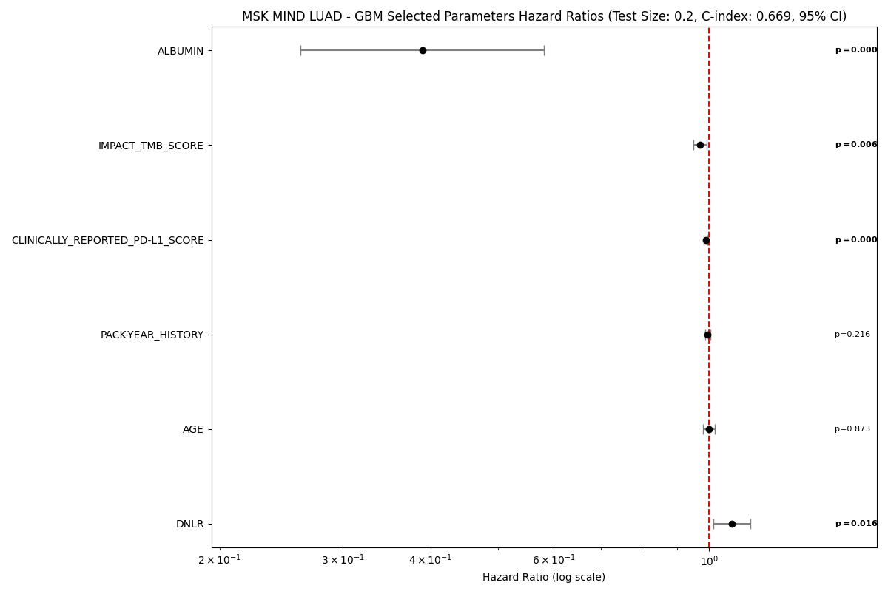

# Clinical and Genomic Biomarkers for Progression-Free Survival in Non-Small Cell Lung Cancer: A Machine Learning Approach

**Paper:**

# Supplementary Figures
## Kaplan-Meier Curves by Parameter

## Forest Plots of Hazard Ratios

